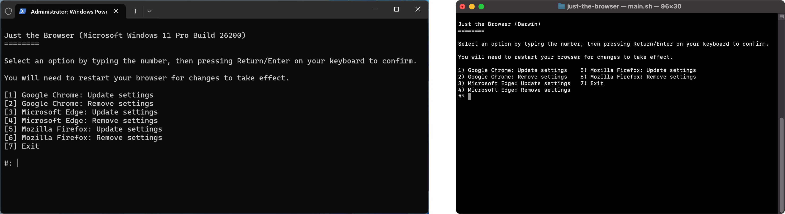

# Just the Browser

Just the Browser helps you remove telemetry data reporting, AI features, product integrations, and sponsored content from desktop web browsers. The goal is to give you "just the browser" with a more streamlined experience, without resorting to alternative web browsers.

This project includes configuration files for popular web browsers, and a script to install them for you. The [GitHub repository](https://github.com/corbindavenport/just-the-browser) includes the code, resources for contributing, and the configuration files.



## Get started

The setup script can do everything for you in a few clicks. You can also follow the manual guides for [Firefox](firefox/README.md).

**Mac and Linux:** open the Terminal application and run the below command:

```
/bin/bash -c "$(curl -fsSL https://raw.githubusercontent.com/corbindavenport/just-the-browser/HEAD/main.sh)"
```

Windows: Not yet supported!

## Download web browsers

Start here if you don't have your preferred web browser installed.

### Google Chrome

- [macOS (Universal)](https://dl.google.com/dl/chrome/mac/universal/stable/gcea/googlechrome.dmg)
- [Windows 64-bit x86 (amd64)](https://dl.google.com/chrome/install/googlechromestandaloneenterprise64.msi)
- [Windows 32-bit x86](https://dl.google.com/chrome/install/googlechromestandaloneenterprise.msi)
- [Windows 64-bit ARM (ARM64)](https://dl.google.com/chrome/install/GoogleChromeStandaloneEnterprise_Arm64.msi)

Not sure which link to use? Try the [official download page](https://www.google.com/chrome/).

### Mozilla Firefox
- [macOS (Universal)](https://download.mozilla.org/?product=firefox-latest-ssl&os=osx)
- [Windows 64-bit x86 (amd64)](https://download.mozilla.org/?product=firefox-msi-latest-ssl&os=win64)
- [Windows 32-bit x86](https://download.mozilla.org/?product=firefox-msi-latest-ssl&os=win)
- [Windows 64-bit ARM (ARM64)](https://download.mozilla.org/?product=firefox-latest-ssl&os=win64-aarch64)

Not sure which link to use? Try the [official download page](https://www.firefox.com/en-US/download/).

### Microsoft Edge

- [macOS (Universal)](https://msedge.sf.dl.delivery.mp.microsoft.com/filestreamingservice/files/39c16afe-6ffe-42f8-aa82-4dd057fcf1d5/MicrosoftEdge-143.0.3650.96.pkg)
- [Windows 64-bit x86 (amd64)](https://msedge.sf.dl.delivery.mp.microsoft.com/filestreamingservice/files/f14840f4-b905-4a62-8b20-b7a2f24512db/MicrosoftEdgeEnterpriseX64.msi)
- [Windows 32-bit x86](https://msedge.sf.dl.delivery.mp.microsoft.com/filestreamingservice/files/6245528d-afd8-4dc0-901b-25b21c16b418/MicrosoftEdgeEnterpriseX86.msi)
- [Windows 64-bit ARM (ARM64)](https://msedge.sf.dl.delivery.mp.microsoft.com/filestreamingservice/files/69576d62-e76d-46d8-aa3a-35aca0a545c3/MicrosoftEdgeEnterpriseARM64.msi)

Not sure which link to use? Try the [official download page](https://www.microsoft.com/en-us/edge/download).