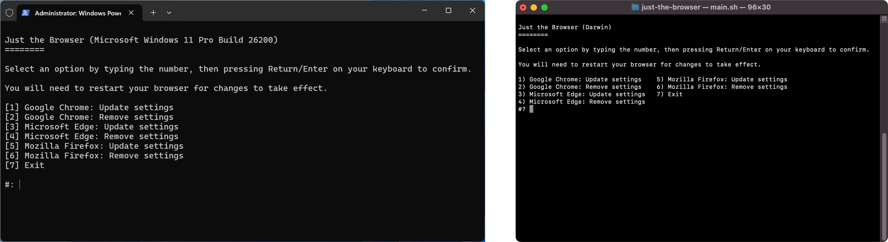

# Just the Browser

Just the Browser helps you remove AI features, telemetry data reporting, sponsored content, product integrations, and other annoyances from desktop web browsers. The goal is to give you "just the browser" and nothing else, using hidden settings in web browsers intended for companies and other organizations.

This project includes configuration files for popular web browsers, documentation for installing and modifying them, and easy installation scripts.



## Install script

The setup script can install the configuration files in a few clicks. You can also follow the manual guides for [Google Chrome](/chrome), [Microsoft Edge](/edge), [Firefox](/firefox), and [Brave](/brave). If you don't like running scripts with administrator/root access, or the script does not work, use the guides instead.

**Windows:** Search for "Windows PowerShell" in the Start Menu, right-click it, and select the "Run as administrator" option. Next, copy the below command, paste it into the window (`Ctrl+V`), and press the Enter/Return key:
```
& ([scriptblock]::Create((irm "https://raw.githubusercontent.com/corbindavenport/just-the-browser/main/main.ps1")))
```
If you are on older versions of Windows, you may need to run this command first:
```
[Net.ServicePointManager]::SecurityProtocol=[Net.SecurityProtocolType]::Tls12
```

**Mac and Linux:** Search for the Terminal in your applications list and open it. Next, copy the below command, paste it into the window (`Ctrl+V` or `Cmd+V`), and press the Enter/Return key:

```
/bin/bash -c "$(curl -fsSL https://raw.githubusercontent.com/corbindavenport/just-the-browser/main/main.sh)"
```


## Documentation and config files

See the [Google Chrome](chrome/README.md), [Microsoft Edge](edge/README.md), [Mozilla Firefox](firefox/README.md), and [Brave](brave/README.md) documentation pages for manual installation instructions, and explanations for each setting. The browser directories also contain the configuration files, which are either JSON files, [Windows Registry .reg](https://en.wikipedia.org/wiki/Windows_Registry#.REG_files) files for Windows, or [Profile Manager .mobileconfig](https://support.apple.com/guide/profile-manager/distribute-profiles-manually-pmdbd71ebc9/mac) files for macOS.

## Website

This repository also includes the static site generator for [justthebrowser.com](https://justthebrowser.com/), built with [Eleventy](https://www.11ty.dev/) and [Simple.css](https://simplecss.org/). The icons are from [Bootstrap Icons](https://icons.getbootstrap.com/).

With Node.js and NPM installed, you can test the site like this:

```shell
npm install
npx @11ty/eleventy --serve
```

The site is compiled and deployed with the `eleventy_build.yml` GitHub Action.

## Subscribe to updates

You can subscribe to the RSS/Atom releases feed to know when the configuration files, documentation, and scripts are updated:

```
https://github.com/corbindavenport/just-the-browser/releases.atom
```

This feed can be used with [Feedly](https://feedly.com/i/subscription/feed%2Fhttps%3A%2F%2Fgithub.com%2Fcorbindavenport%2Fjust-the-browser%2Freleases.atom), [Inoreader](https://www.inoreader.com/?add_feed=https://github.com/corbindavenport/just-the-browser/releases.atom), [The Old Reader](https://theoldreader.com/feeds/subscribe?url=https://github.com/corbindavenport/just-the-browser/releases.atom), [Feedbin](https://feedbin.me/?subscribe=https://github.com/corbindavenport/just-the-browser/releases.atom), or any other reader tool. You can also subscribe to new releases with your GitHub account by clicking the Watch button at the top of the page, then selecting Custom > New releases.